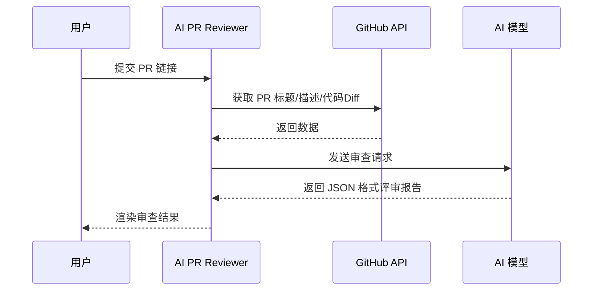

# 🤖 AI-PR-Review 自动代码审查助手

本项目是一个基于大模型（DeepSeek）的自动化 GitHub PR 审查工具，专注于代码 Bug 检查与提交规范（Conventional Commits）检查。

### 🚀 在线体验 (Demo)
点击下方链接，无需下载，直接使用 AI 审查功能：
👉 **[https://ai-pr-review-lxz6lxgzqydu6bbsjiglzr.streamlit.app/]**

## 💡 功能特性

* 🔌 **无缝对接 GitHub**
  实时抓取 PR 标题、描述及深度代码 Diff，绝不放过任何一处修改细节。
* 🧠 **DeepSeek 智能驱动**
  不仅能像老兵一样精准揪出底层 Bug，还能自动像强迫症一样校验 `feat:`、`fix:` 等提交规范。
* 🚀 **开箱即用的极简交互**
  厌倦了繁琐配置？内置“一键随机演示”直接上手，外加坚如磐石的容错机制，告别崩溃焦虑。
  
### ⚙️ 系统架构

## 🎥 演示视频 (Demo Video)

快速了解代码助手的核心功能，请点击下方链接观看演示视频：

* 📺 **Bilibili 在线观看**：
【AI代码助手 - 核心功能演示】https://www.bilibili.com/video/BV1SjVQ68EbP?vd_source=8ab476e8dfc703b2a54a1333667664de
